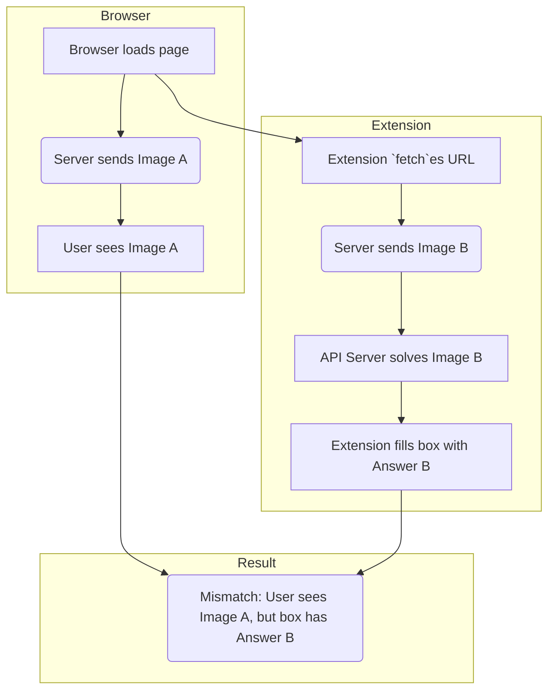
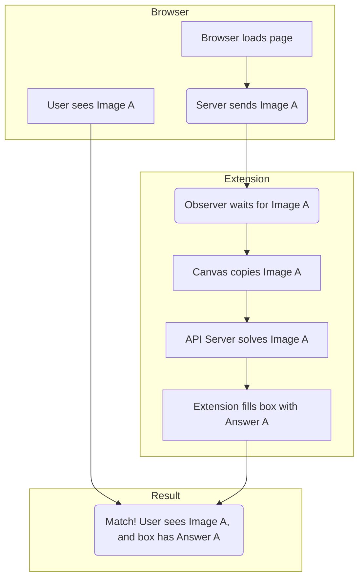

# e-Courts Captcha Solver

This project is a complete full-stack solution to automatically solve and fill captchas on the e-Courts judgments website. It consists of a Python FastAPI backend that runs an ONNX machine learning model and a Chrome Extension frontend that interacts with the webpage.

This was built as part of an internship assignment.

## Features

* **Automated Solving:** Automatically detects and solves the captcha on page load.
* **Auto-Fill:** Fills the captcha input box with the solved text.
* **Refresh Detection:** Automatically re-solves the captcha if the user clicks the "refresh" button.
* **ML Backend:** Uses a high-performance FastAPI server to run the `captcha.onnx` model.

## Tech Stack

* **Backend:** Python, FastAPI, ONNX Runtime, `uvicorn`, Pillow, Torch
* **Frontend:** JavaScript (Chrome Extension API)
* **Model:** `captcha.onnx` (provided for the assignment)

## How It Works: The Approach (v1 vs. v2)

The main challenge was handling how the website serves its captcha.

### Initial Approach (v1 - "Simple Fetch")

The first version of the extension worked, but with a confusing side-effect. The extension would `fetch()` the captcha URL, which was a *new* request to the server. This created a "visibly wrong" mismatch, where the text in the box (Answer B) did not match the image on the screen (Image A).

**Note:** While visually confusing, this method **still works** and successfully bypasses the captcha. This is because the server's session is updated by the `fetch` request to expect "Answer B", which is exactly what the extension provides.


### Final Approach (v2 - "Observer + Canvas")

The final, robust version (`content.js` in the repo) solves this mismatch for a better user experience. It does **not** `fetch` a new image. Instead, it uses a `MutationObserver` (a "watchman") to wait for the *real* image to appear, and then uses a `<canvas>` (a "photocopier") to copy its pixels.

This way, the solved text always matches the visible image.


## Setup and Installation

This project has two parts: the **server** (backend) and the **extension** (frontend).

### 1. Backend Server

1.  Navigate to the `server/` directory:
```bash
    cd server
```
2.  Create and activate a Python virtual environment:
```bash
    # Create the venv
    python -m venv venv

    # Activate on Windows (Git Bash)
    source venv/Scripts/activate

    # Or on Windows (CMD/PowerShell)
    .\venv\Scripts\activate
```
3.  Install the required libraries:
```bash
    pip install -r requirements.txt
```

### 2. Frontend Extension

1.  Open the Google Chrome browser.
2.  Go to the extensions page by typing `chrome://extensions` in the address bar.
3.  Turn on the **"Developer mode"** toggle (usually in the top-right corner).
4.  Click the **"Load unpacked"** button.
5.  Select the `extension/` folder from this project.
6.  The "e-Courts Captcha Solver" will appear in your extensions list.

## How to Run

1.  **Start the Server:**
    Make sure your virtual environment is active in the `server/` directory, then run:
```bash
    uvicorn api:app --host 127.0.0.1 --port 5000
```

    Your server will be running at `http://127.0.0.1:5000`.

2.  **Use the Extension:**
    With the server running and the extension loaded, simply visit the e-Courts website:
    `https://judgments.ecourts.gov.in/pdfsearch/index.php`

    The captcha will be solved and filled in automatically.
